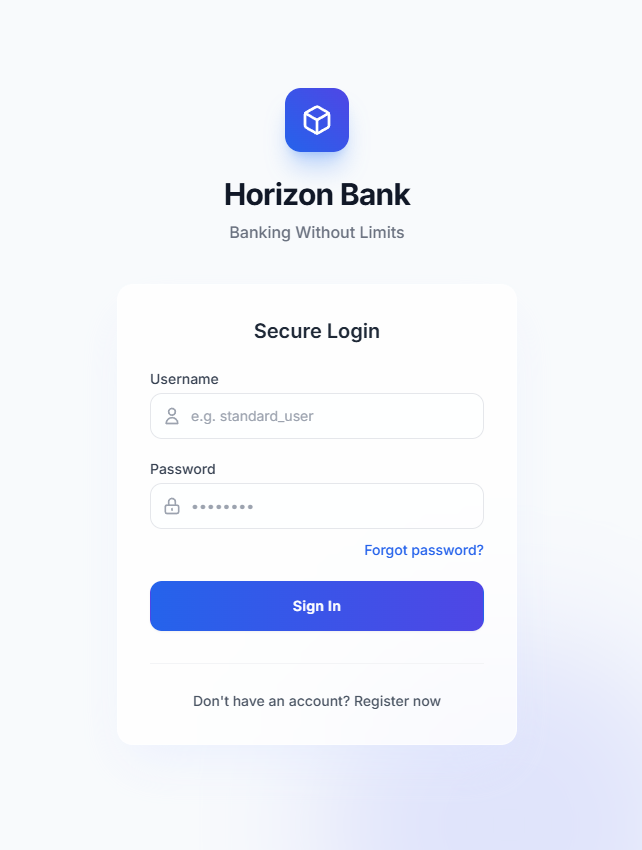

<p align="center">
  
</p>

# Horizon Bank - QA Demo Environment

Horizon Bank is a deliberately vulnerable and buggy online banking web application built specifically for QA, security, and manual testing portfolios.

## Intentional Defects
This application contains **exactly 12 intentional defects** of varying severities. They include logic errors, UI/UX issues, random server errors, and performance bottlenecks.

## Technologies Used
- **Frontend**: HTML5, Vanilla JavaScript, Tailwind CSS (via CDN)
- **Backend / API**: `json-server` wrapped in `express`
- **Data Storage**: Local `db.json` and browser `localStorage`

## Project Structure
```
Horizon-Bank/
│
├── backend/                  # API server mimicking backend logic
│   ├── db.json               # Seeded database with users, accounts, and transactions
│   ├── server.js             # Express app exposing endpoints and defects
│   └── generate_db.js        # Script to generate initial db.json
│
├── frontend/                 # Frontend Web App
│   ├── index.html            # Login
│   ├── dashboard.html        # Main Overview
│   ├── account.html          # Transaction history with filters
│   ├── transfer.html         # Internal/External transfers
│   ├── billpay.html          # Bill payments
│   ├── profile.html          # User profile settings
│   ├── css/style.css         # Styling and micro-animations
│   └── js/                   # Shared API and utility scripts
│       ├── api.js            # Fetch wrappers
│       └── app.js            # UI utilities
│
└── QA/                       # Testing Documentation & Postman Collection
    ├── Test_Plan.md
    ├── Test_Cases.md
    ├── Bug_Reports.md
    ├── Test_Report.md
    └── Horizon_Bank_Postman_Collection.json
```

## How to Run the Application Locally

### Prerequisites
- Node.js installed

### 1. Launch the Backend Backend
Open a terminal and navigate to the `backend` folder:
```bash
cd backend
npm install
node server.js
```
The API will run on `http://localhost:3000`.

Or open directly: `file:///path/to/Horizon-Bank/frontend/index.html`

## Test Users (Passwords are `horizon123!` for all)
1. **`standard_user`**: General healthy user.
2. **`locked_out_user`**: Triggers fake locked account issue.
3. **`problem_user`**: Encounters severe logic bugs (e.g. transfers where balance doesn't deduct).
4. **`performance_glitch_user`**: Experiences forced 4-7 sec delays on API calls.
5. **`error_user`**: Experiences random 500 server errors on bill payments.
6. **`visual_user`**: Uncovers specific CSS/UI bugs on buttons.

## QA Portfolio Content
See the `QA/` folder for comprehensive testing documentation:
* **Test Plan**: Approach and scope.
* **55 Test Cases**: Detailed functional validation.
* **12 Bug Reports**: Ready-made Jira-style reports covering every hidden defect.
* **Postman Collection**: Fully configured API requests to test backend defects programmatically.
* **Test Report**: Final summary metrics.
